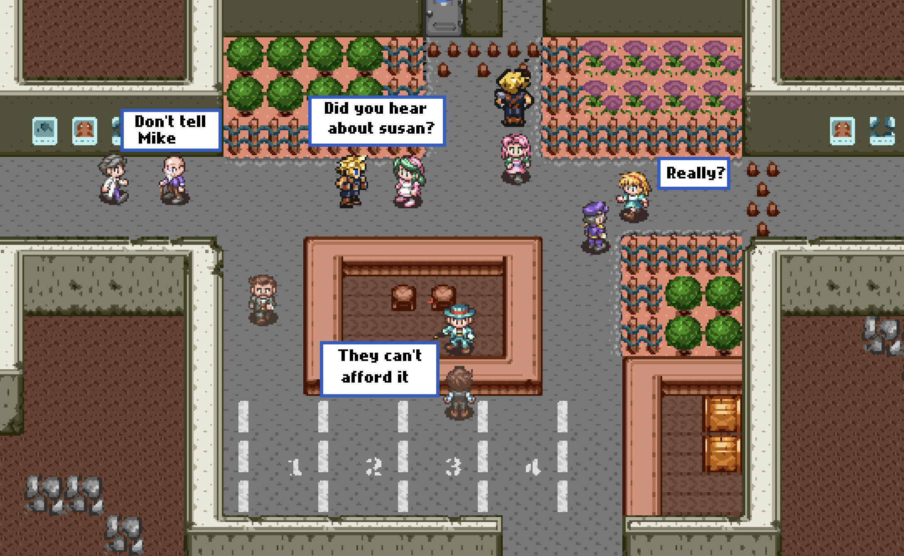
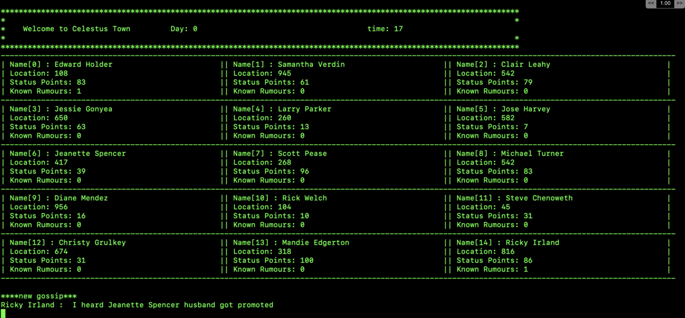

#               Gossip Simulator

## Author 
 
- Adam McMurchie
  
## Contributors  

- Adam McMurchie
- HaoYu Chen 

In Yuval Harai's pivotal book [Sapiens](https://www.ynharari.com/book/sapiens-2/) the author explains how Story Telling and collective belief define the human race. In fact these uniquely human characteristics may have helped differentiate Sapiens from their historical competitors and allowed us to thrive into the technological society we have today. 

## Building Digital Fishwives 

In this project I (Adam McMurchie) plan to build a series of bots which will simulate how a world will evolve overtime via a colection of rules which defines risks and rewards of gossip creation. These rules will be set at three tiers, environmental level, social level and household level. 

 Dumb rules based optimisers will play part of the relatively disengaged population who partake in occasional gossiping. 

 The Digital Fishwife: will be AI optimisers designed with two main optimisers in consideration:

 - Propagate Gossips
 - Gain Status by generating Rumors

 This may seem like the same thing, but one AI Optimiser will be tasked with keeping a gossip going and spreading it to as many people as possible. 

Another optimiser will be tasked with gaining as much points by abusing the system to their benefit (it might not mean spreading it far and wide).

  
# Table Of Contents. 

- [Objectives](#Objectives)
- [MVP](#MVP)
- [Rules](#Rules)
- [Citizen Archetypes](#Citizen-Archetypes)
- [OBJECTS](#OBJECTS)
- [Function-List](#Function-List)
- [Feature BackLog](#Feature-BackLog) 
- [Additional Reading](#Additional-Reading)
- [Second Brain Storming Round](#Second-Brain-Storming-Round)

# Objectives
-----------

1. Simulate Gossip Utility in Society 
2. Create a world with bots and AIs who interact and talk 
3. Observe how gossips can be used to increase status points, life expectivity and other realtionships.
  
We want to observe `emergence` , this means having as little interference in the rules as much as possible to see how the agents change and adapt to produce complex behaviours. 

We also want to observe the opposite, by enforcing complex rules how agents develop solutions. 

As such we want to be able to test rigously various parameters from both agent flexibility and creativity to explore the connections between gossip and other fundamentals as we change the parameters. 

  

# MVP
-----------------  
  
**Coding Paradigm:**   
*Functions First Personality Later!*  
*All state must be kept in main.py*  

## Rules
 

- Environment has a time engine. 
- Gossip can be created
- Gossip can be positive or negative (in terms of impact to target)
- Gossip can be about one or multiple targets. Even about no targets.
- Gossip has an associated risk. 
- Gossip has a shelf life/popularity (value decreases to 0)
- Gossips will be associated to citizens who spread or create it.
- Citizens can only create or share gossips when near other people
- Citizens age and die
- Citizens (normally) want more status points
- Creating gossips gain you status points or removes some

Too much Gossip creation lowers the value of a gossip. 

creating a gossip can gain you status-points
creating a gossip can dock you status-points [function of risk]

## Citizen Archetypes 

You get four main different types of people. 

- Creator of gossip
- Peristor of gossip 
- Target of Gossip [take statuspoint damage/benefit for gossip value.]
- Non-participant

## Core Citizen Attributes

- Status-Points
- ID Names
- Age

# OBJECTS
-------------
## Environment 
  
- `time`
- `time_interval` a sleep value 
  

## citizen_list 

Each citizen has: 

| Object                      | Values |
| ----------- | ----------- |
| **name (Pkey)**                        | uniqueValue (use random name generator so can be in json and prevent duplicates) |
| **status_points**             | initialised as `random(0,100)`|
| **create_gossip_probability** | initialised as `random(0,100)` |
| **spread_gossip_probability** | initialised as `random(0,100)` |
| **age**                       | random int 0-100 |
| **friends**                   | initialised as `int(0)` |
| **position**                  | initialised as `random(0,1000)` |
| **subjective_gossip_tracker** | `empty {}`|

## 2. Objective Gossip Database 

To be referenced by individuals, they wont have access to all values.  

| Object                      | Values |
| ----------- | ----------- |
| **gossipID (key)**              | `string( int(value) )` value increments |
| **creator**                     | [citizen_list]name (Pkey) |
| **target**                      | [citizen_list]name (Pkey) |
| **sentiment** | `random(-100,100)` |
| **rumour**                      | `string` |
| **risk**                        | `random(0,100)`|
| **persistence**                 | `random(0,100)` |
| **spread_count**              | `int(value)`value increments |
| **associated_citizens**         | initialised as `random(0,1000)` |

#### 3. Subjective Gossip Tracker 

This tracker is a sub database in the `citizen_list`, it can be used as a key to access the core gossip database for certain info.

- `gossipID (key): [id]`
- `Action: [created, spreaded]`
- `my_associated: [id]` 

# Function List
--------------------
**Needs Updating** a lot more has been added since.  

1. `Main.py`
2. `create_citizens.py`
3. `walk.py`

A. `printer.py`
B. `utils.py`

## main.py 

- calls create citizens function
- increments time
  
## create_citizens function   

## Movement Function 

- Check if near citizen (seperate function)
	- If no citizens within 20: moveProb = create_gossip_probability + spread_gossip_probability
	- if within 20 of citizen: chance 
- move random value (-10,10)
- if pos > 1000: pos = pos - 1000
- if pos < 0: pos = 1000 - pos

## create_gossip_function

- Can only create a gossip when in contact with one or more people. 

## send_gossip_function

- check if in vicinity of citizen(s) 

## Utils 

# Simulation Flow
--------------------

1. Initialise Citizens 
2. Intialise gossip db
3. Tick Time increments

| Step        | Requirements |
| ----------- | ----------- |
| Initialise Citizens      | `create_citizen.py`       |
| Initialise Gossip DB   | `create_gossip_db.py`        |

    
### 1. Create Simulation  

### 2. Simulate Citizen

- Time Ticks an increment
- Each Person processes a move
- If user gossip creation Value * randint(0-50) > 100 create gossip

### 3. Simulate Environment

- After given time increment end round
- Tick down gossip popularity rating
- Kill citizen if below a certain status point
- Kill citizen if above a certain age 

- After certain time increment inject new citizens

**All Things below are the full features to be considered**  

# Feature BackLog
--------------

- Allow target to be more than one
- Status Multiplier
- Include end-of-day review?  
- Create Versions
- MVP
- Boredom 
- Pygame
- Friendly fire
- Guilt by association. 
- Risk calculation must take into account the status of the spreader
- Combined status of your group 
- Environment [office, home,library, school, shop]
- Rumour Mutates (and mutate subjective sentiment and global ) FEEDBACK EFFECT (IMPACTS SPREADERS)
- Citizen Relationships [family, friends, partner,enemy,admired]
- order of rumour 
- Allow people to play multiplayer 5 to 10 people
- ` statuspoints <-> maximum age`
- subjects/ politcs, sport etc to be included.  

## STRETCH Atrributes (may not be implemented)

- Stimululus/happiness index (non-spreader)

- Instigator function

negative gossip positive-status-points positive-risk	

- Speader function

- Target

Is affected by a gossip 

# Bot Behaviour

### This will be set by citizen personality
- creator boolean on/off
- Spreader boolean on/off

## AI Optimisers

1. Spread gossip as far and wide as possible and/or to get it to last forever [AI DAVE]
2. Selfish create gossip to gain status points. [AI BOB]
3. Generic optimizer - looks for trends and copies the most succesful

Rules
-----------------

Environment has a time engine. 

Gossip can be created

Gossip can be positive or negative (in terms of impact to targ)

Gossip has a shelf life (value decreases to 0)

Too much Gossip creation lowers the value of a gossip. 

creating a gossip can gain you status-points
creating a gossip can dock you status-points [function of risk]

## Risk 

Gossip can backfire if boring
Gossip can backfire if 
Creating gossping about a high status point person increases risk (top 70-95%)
Gossping about top 95-100% is fun, doesn't generate much status points or risk. 

Retaliation 

## Ideal Features

- Visualise it in a game format 
- Visualise it in a datapipeline 

## Environment 

to get it going, just create gossips with any other id != self

Stretch

Location 
move about
can only create gossip or spread gossip or recieve gossip if x < 10 meters of another citizen 

Environment locations affect gossip score

office X2 
home x1
dock street -x1
Neutral Location scores: 

## Additional Reading

1. [sapienship](https://www.sapienship.co/activities/storytelling)
2. [Gossip Protocal](https://en.wikipedia.org/wiki/Gossip_protocol) 

Gossip Protocal has some shared concepts used in this simulation, such as the following: 
 
- Reliable communication is not assumed.
- The information exchanged during these interactions is of bounded size.
 
But differs in many aspects, a few are: 

-  There is some form of randomness in the peer selection. Peers might be selected from the full set of nodes or from a smaller set of neighbors. (Not in this case, it will be determined by location and personality of the citien)
- Due to the replication there is an implicit redundancy of the delivered information. (Not in this case, humans/agents will mutate the information as it replicates) 

## Core Axioms  
  
- Reliable communication is not assumed.
- The information exchanged during these interactions is of bounded size.
- Gossip has an underlying driver (possibly status points)

## Second Brain Storming Round 

FEATURES TO DO 
--------------
1. Risk calculation must take into account the status of the spreader
2. Combined status of your group 
3. Environment [office, home,library, school, shop]
4. Rumour Mutates (and mutate subjective sentiment and global ) FEEDBACK EFFECT (IMPACTS SPREADERS)
5. Citizen Relationships [family, friends, partner,enemy,admired]
6. order of rumour 
7. Allow people to play multiplayer 5 to 10 people
8. ` statuspoints <-> maximum age`
9. subject/ politcs 

INFO
-------
- How do we define Risk 
1. Chose random values
 ` Risk <-> statuspoints` relationship
2. Chose parameters based upon reseach
3. Use an AI genetic algorithm to train it to match a natural state. 
   (Im gonna need some real data)
4. We want to sample/try/test different optimised labels

maximumAgeg = random.noraml(0,100) * StatusPoints

Run number 1: Target Label = Age
Run number 2: Target Label = StatusPoints

Run number 999: Target Label = StatusPoints

